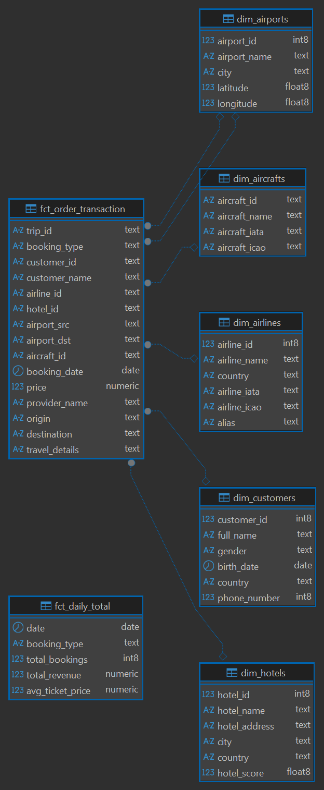
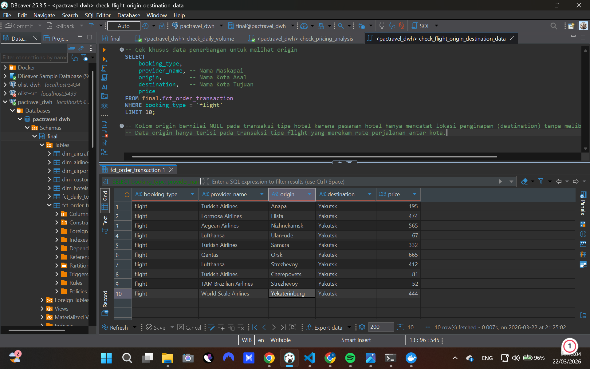
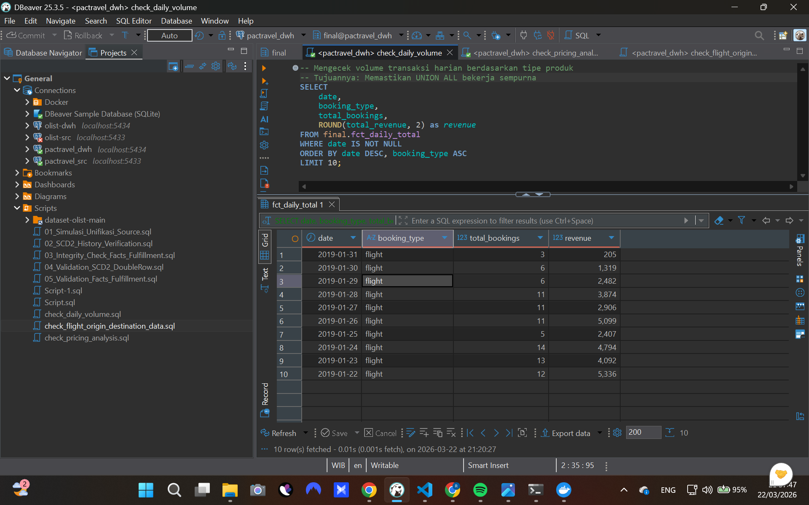
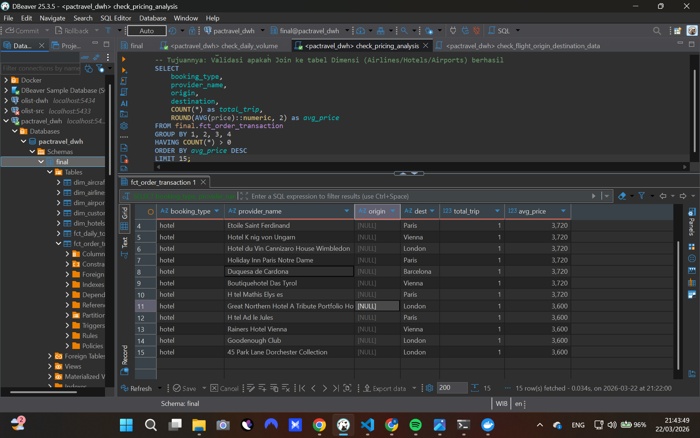

✈️ PacTravel Data Warehouse & ELT Pipeline Project

Step #1 - Requirements Gathering 
Description of Data Source
Data utama berasal dari sistem operasional PacTravel yang mencakup ekosistem perjalanan menyeluruh:

1. Data Master: Terdiri dari informasi pelanggan (customers), maskapai (airlines), hotel, bandara (airports), dan armada pesawat (aircrafts).

2. Data Transaksi: Berupa catatan pemesanan terpisah untuk tiket pesawat (flight_bookings) dan reservasi penginapan (hotel_bookings).

Format & Konteks: Data disimpan dalam format relasional PostgreSQL. Tantangan utama terletak pada struktur data yang terfragmentasi, sehingga memerlukan proses integrasi untuk menghasilkan laporan yang komprehensif.

Problem
Stakeholder PacTravel saat ini kesulitan dalam:

1. Fragmentasi Data: Informasi transaksi hotel dan penerbangan berada pada tabel yang berbeda, menghalangi pandangan holistik terhadap performa bisnis harian.

1. Analisis Terpadu: Tidak adanya sistem otomatis untuk memantau fluktuasi harga tiket dan volume pemesanan antar rute secara real-time.

Solution
Membangun infrastruktur Data Warehouse dengan skema Star Schema dan pipeline ELT (Extract, Load, Transform). Pipeline ini akan menyatukan data mentah ke dalam tabel dimensi dan fakta yang siap digunakan untuk kueri analitik kompleks.

Step #2 - Designing Data Warehouse Model 
Dimensional Model Process
Select Business Process: Order Transaction (Proses pemesanan layanan travel).

Declare Grain:

1. Tingkat Detail (Atomic): Satu baris data mewakili satu transaksi produk (penerbangan/hotel) oleh pelanggan.

2. Tingkat Ringkasan (Aggregate): Satu baris data mewakili total transaksi harian untuk setiap kategori produk.

Identify The Dimension:
dim_customers, dim_hotels, dim_airlines, dim_airports, dim_aircrafts.

Identify The Fact:
Dalam desain ini, digunakan dua jenis tabel fakta untuk memenuhi kebutuhan analisis yang berbeda:

fct_order_transaction (Transaction Fact Table): Menyimpan setiap detail transaksi secara granular. Digunakan untuk analisis mendalam seperti performa rute bandara atau efisiensi armada pesawat.

fct_daily_total (Aggregated Fact Table): Menyimpan ringkasan harian. Tabel ini dirancang untuk mempercepat performa laporan eksekutif terkait tren pendapatan dan volume transaksi tanpa harus memproses jutaan data detail setiap saat.

SCD Strategy:
Menerapkan SCD (Slowly Changing Dimension) Type 2 pada dimensi pelanggan (dim_customers) untuk melacak riwayat perubahan data (seperti perubahan domisili), guna memastikan integritas data historis di tabel fakta tetap akurat.

Diagram Data Warehouse: ERD
Gambar 1: Visualisasi Star Schema di DBeaver. Tabel fakta pusat terhubung ke semua dimensi melalui 6 jalur Virtual Foreign Key.

### **Hasil ERD (Entity Relationship Diagram)**


Step #3 - Data Pipeline Implementation (50 Points)
Workflow
Pipeline ini mengimplementasikan alur kerja ELT modern:

1. Extract & Load: Data diekstraksi dari database operasional dan dimuat ke skema staging di Data Warehouse menggunakan Python (main.py) yang berjalan di dalam environment Docker.

2. Transform: Menggunakan dbt (data build tool) untuk memproses data dari staging ke skema final.

3. Proses: Pembersihan tipe data (terutama penanganan ID pesawat yang mengandung string), penggabungan data (UNION ALL), dan denormalisasi atribut (seperti menyertakan nama kota asal dan tujuan langsung di tabel fakta).

Scheduling & Alerting
1. Scheduling: Untuk saat ini dijalankan secara manual via CLI dbt. Arsitektur ini siap dijadwalkan menggunakan Apache Airflow atau GitHub Actions untuk automasi produksi.

2. Alerting: Pengecekan kualitas data terintegrasi dalam log dbt. Kegagalan pada salah satu model akan menghentikan proses downstream secara otomatis untuk mencegah inkonsistensi data.

Code Repository Structure
Folder utama transformasi berada di: /pactravel_transform
Kueri analisis validasi berada di: /pactravel_transform/analyses/

Step #4 - Show Results of the Pipeline 
1. Berhasil Menjalankan dbt (PASS=7)
Eksekusi pipeline menunjukkan seluruh 7 model (5 dimensi dan 2 fakta) berhasil dibuat dengan sempurna.

2. Hasil Validasi Data Melalui Script SQL
Untuk membuktikan pipeline berjalan sesuai persyaratan bisnis, beberapa kueri validasi dijalankan menggunakan file SQL yang tersimpan di folder analyses:

Verifikasi Rute & Join Dimensi (analyses/check_flight_origin_destination_data.sql):
Script ini memastikan tabel fakta telah berhasil menarik data nama kota dari dim_airports.
Gambar 2: Hasil validasi rute. Nama kota pada origin dan destination muncul dengan benar untuk tipe 'flight'.

### **Hasil Validasi Rute Penerbangan**


Verifikasi Volume Harian (analyses/check_daily_volume.sql):
Memastikan data pada fct_daily_total telah teragregasi secara akurat per hari.
Gambar 3: Ringkasan pendapatan harian untuk memantau performa bisnis.

### **Hasil Validasi Volume Harian**


Analisis Harga & Provider (analyses/check_pricing_analysis.sql):
Digunakan untuk memantau harga rata-rata antar penyedia layanan (maskapai/hotel).

### **Hasil Eksekusi dbt (PASS=7)**


Laporan ini disusun sebagai dokumentasi lengkap atas proses pembangunan Data Warehouse PacTravel. Seluruh skrip, model dbt, dan aset visual tersedia di repositori ini untuk diverifikasi lebih lanjut.

🚀 Cara Menjalankan Pipeline
Persiapan: Pastikan Docker telah berjalan.

Replikasi Database: Jalankan ```docker-compose up -d``` 

Inisiasi Data: Jalankan ```python main.py```

Transformasi Data:
-----------------------------------------------------------------------------------------------------------------------------------------------------------------------------
# PACTRAVEL - ELT Pipeline Orhcestration For Exercise 3
## How to use this Data?
1. Requirements
2. Preparations

### 1. Requirements
- Tools :
    - Dbeaver/SQL Client
    - Docker

### 2. Preparations
- **Clone repo** :
  ```
  # Clone
  git clone [repo_link]
  ```
- **Create .env file** in project root directory :
  ```
    # Source
    SRC_POSTGRES_DB=pactravel
    SRC_POSTGRES_HOST=localhost
    SRC_POSTGRES_USER=postgres
    SRC_POSTGRES_PASSWORD=mypassword
    SRC_POSTGRES_PORT=5433

    # DWH
    DWH_POSTGRES_DB=pactravel-dwh
    DWH_POSTGRES_HOST=localhost
    DWH_POSTGRES_USER=postgres
    DWH_POSTGRES_PASSWORD=mypassword
    DWH_POSTGRES_PORT=5434
    ```


- **Run Data Sources & Data Warehouses** :
  ```
  docker compose up -d
  ```

- **Dataset**
    - Source: Pactravel
    - DWH:
        - staging schema: pactravel
        - final schema: final
